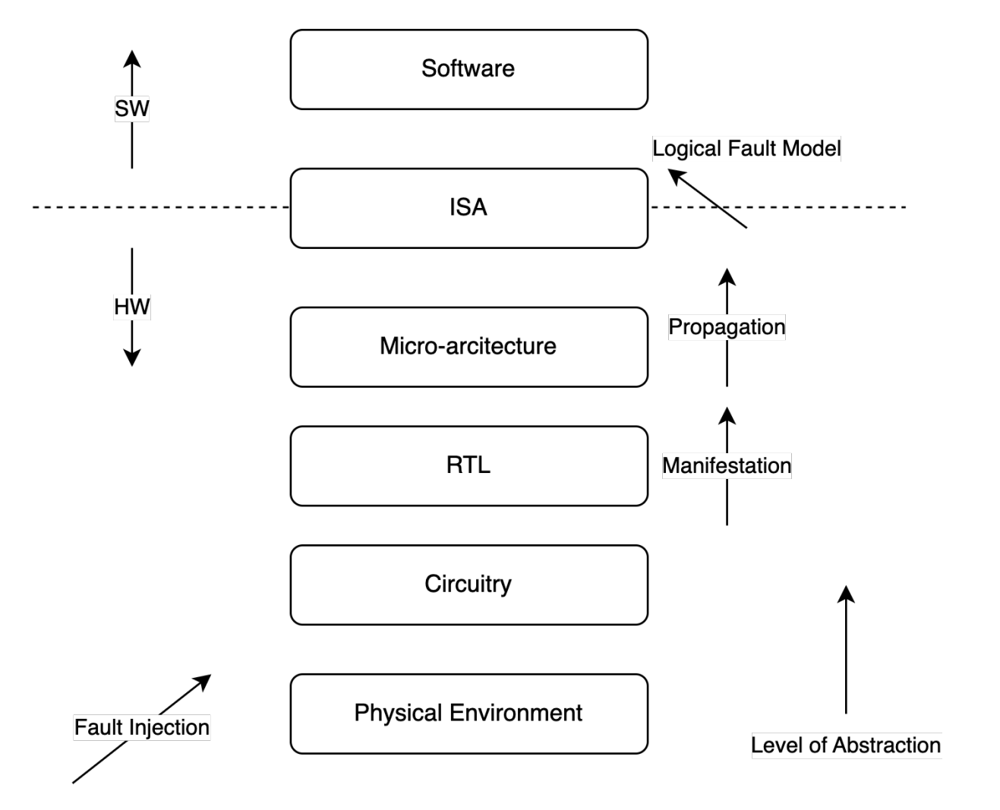
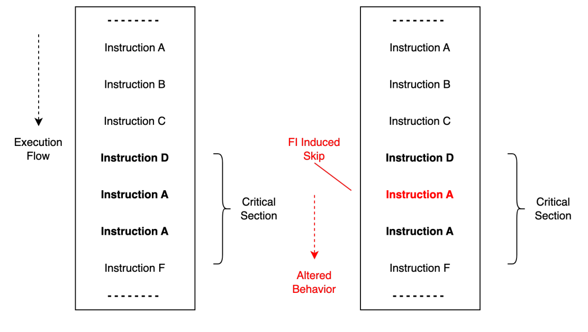

This post is an introduction to physical attacks known as Fault Injection (FI). An increasingly popular offensive technique targeting  OT and IoT devices in the field.

## What is Fault Injection 
FI attacks is a set of techniques that induce physical stress upon a system in an attempt to facilitate further exploitation in software.

Several physical techniques and tools exist to conduct FI attacks. By stressing the system and placing it outside its intended operating environment, it can alter its behavior temporarily.

This is done with highly specialized tools by conducting changes in voltage supply or clock frequency, temperature changes,
interference from electromagnetism, or directed laser rays. 

An increasingly popular tool is the Chipwhisperer, which is able to perform voltage and clock glitching attacks at a low cost.[1]

Overall, the shared intended objective for these tools is to create a viable method that can produce a repeatable deterministic flaw in a system. 


## What systems are prone to this threat
The task becomes increasingly difficult the more feature rich and convoluted the target is.

An increase in complexity makes it difficult for the attacker to know  when, where, and how to induce the attack from a physical standpoint.
This requires a clear strategy and approach as to how the physical attack is intended to affect the system.

A resource constrained device executing a single-threaded application on bare-metal systems  will be an easier target compared to a
multi-core system with several applications and an OS employing memory virtualization. 

FI is therefore often found targeting resource constrained devices, such as that within the domains of IoT and OT.
The very same segment currently seeing the most growth overall in terms of computing devices.


## Fault models
We can view the effects of FI as changes throughout the abstraction layers of a physical device.
By interfering with the electronic circuitry, an induced fault will manifest itself in hardware as a value-change. Such as a bit-flip in a register.
It will then propagate up to the instruction layer, observable as a behavioral change in software.


<p><center>

</p></center>


By understanding the characteristics of an induced fault throughout the system we can abstract an attack into logical fault models,
and evaluate its effect on the running software.

Fault models can be viewed as  either an alteration in execution flow, for instance through the skipping of selected instructions in an instruction stream.
Or data flow by altering the data stored in registers operated on by the system processor.

<p><center>

</p></center>

These fault models can then be applied by targeting selected variables and conditionals in code.


## Example threats


A successful attack will have the capability to interfere directly with the system processor, tampering with its execution environment making the software enter an unintended state of operation.

For systems within the realm of OT and IoT, these sections can comprise of the controlling, monitoring or automated decision-making that supports industrial processes and critical infrastructure.

```
safety_limit = get_safety_limit();
temp = get_temperature();

while( temp < safety_limit ){

    perform_critical_operation();

    temp = get_temperature();
}

```
An example target sequence can be the controlling of an industrial process regarding temperature for a production facility. 
Although simplified, the depicted code block conveys the execution of a critical part of code regarding safety limits on temperature.

From this section alone, we can identify a branch condition in the form of a while loop, and a critical variable holding temperature data that directs the outcome of the branch condition.
Both code primitives are potential candidates for tampering through valid fault models. 

Maliciously altering the conditions in this critical section may cause the system to continue its operation, despite exceeding preset limits.
Depending on the application of use, the ability to maliciously control large-scale systems within industrial facilities has a high potential for catastrophic outcomes.


## Closing remarks
In conclusion, FI-based attacks has a strong presence in the growing threat landscape of OT and IoT-oriented systems.
For a deeper dive, I enjoyed this paper[2] that I consider to be a great resource on defining fault injection attacks.


## References
[1] https://chipwhisperer.readthedocs.io/en/latest/getting-started.html <br>
[2] https://link.springer.com/article/10.1007/s41635-018-0038-1 <br>
